## Jess Haley, PhD

<table><tr>
<td width="37%">

Data scientist and scientific software engineer. I design experiments, build the
statistics to test them, and write the pipelines and infrastructure around both.

</td>
<td width="63%">

</td>
</tr></table>

[LinkedIn](https://www.linkedin.com/in/jess-a-haley/) ·
[Google Scholar](https://scholar.google.com/citations?hl=en&user=z7coTFkAAAAJ) ·
[ORCID](https://orcid.org/0000-0001-6282-7124)

**Currently** — Software Engineer and Data Consultant at Waltham Data Science,
building analysis pipelines, models, and data infrastructure for client research teams.

**Background** — PhD in Computational Neuroscience, UC San Diego. My dissertation
combined controlled experiments with quantitative modeling to identify what drives
decision-making, published in *eLife*.

### Projects

- **Bloom** — a specialty coffee and tea app for iOS (Swift, SwiftData) with a
  TypeScript edge backend, currently pre-launch. Beyond the app, it is a testbed for
  on-device personalization: a within-user recommender built on a hand-rolled weighted
  ridge regression that reports a lower confidence bound rather than a point estimate,
  evaluated with a leakage-aware time-split backtest and a feature-ablation ladder.
  It also carries an LLM application tier and a structured feedback and help pipeline.
  ~2,000 automated tests with CI.
- **Bloom Experiment** — a Python (NumPy/SciPy) A/B testing library built around Bloom's
  freemium funnel: randomized assignment, sample-ratio-mismatch checks, power and
  minimum-detectable-effect, CUPED variance reduction, always-valid sequential testing,
  multiple-comparison control, and a ship/no-ship decision layer. Validated in simulation
  against known ground truth.

Both are private repositories for now.

### Public repositories

- **[haley_et_al_2024](https://github.com/jesshaley/haley_et_al_2024)** — analysis package for
  [Haley et al., *eLife* 2024](https://doi.org/10.7554/eLife.103191): experimental design,
  multi-stage classification, a generalized linear model with a custom likelihood, and
  hierarchical bootstrap inference. The full dataset is released openly on
  [NDI Cloud](https://doi.org/10.63884/ndic.2025.pb77mj2s).
- **[matty_et_al_2022](https://github.com/jesshaley/matty_et_al_2022)** — analysis package for
  [Matty et al., *PLOS Genetics* 2022](https://doi.org/10.1371/journal.pgen.1010178).
- **[haley_hampton_marder_2018](https://github.com/jesshaley/haley_hampton_marder_2018)** —
  analysis package for
  [Haley, Hampton & Marder, *eLife* 2018](https://doi.org/10.7554/eLife.41877).

<!--

  
   
  

-->
